# AgenticEDAModellingTool — Features & Capabilities

A deep tour of every feature in v1. Diagrams are [Mermaid](https://mermaid.js.org/)
(renders inline on GitHub).

---

## Why this tool exists

Most "agentic ML" tools are a thin LLM wrapper around AutoML — the model
runs experiments, claims a number, and stops. That's a research demo,
not a platform.

This framework is built around five hard commitments that make it
useful in an organization:

1. **Determinism is sacred.** Every artifact is reproducible. Replay is
   a first-class operation.
2. **Schemas are the source of truth.** Every artifact a Mission, plan
   dict, experiment row, sketch manifest, recommendation is a
   pydantic-validated, version-stamped model. The agent reads structured
   state and writes structured outputs.
3. **The agent never reads raw data.** It interacts with a compact
   <1MB *Process Data Sketch* via an MCP tool surface, and delegates plan
   execution to a Haiku sub-agent.
4. **Honest failure is shippable.** "No actionable signal — collect
   more data on X" is a valid project outcome with a defined confidence
   tier.
5. **Knowledge compounds across projects.** Completed projects merge
   into `main`; CI extracts anonymized patterns into `knowledge/`
   which future projects automatically retrieve from.

The result: a small surface (six slash commands + five CLI verbs), an
auditable trail (every decision traces to an experiment id or sketch
query), and a system that gets better at your organization's data
shape with every project that ships.

---

## High-level architecture

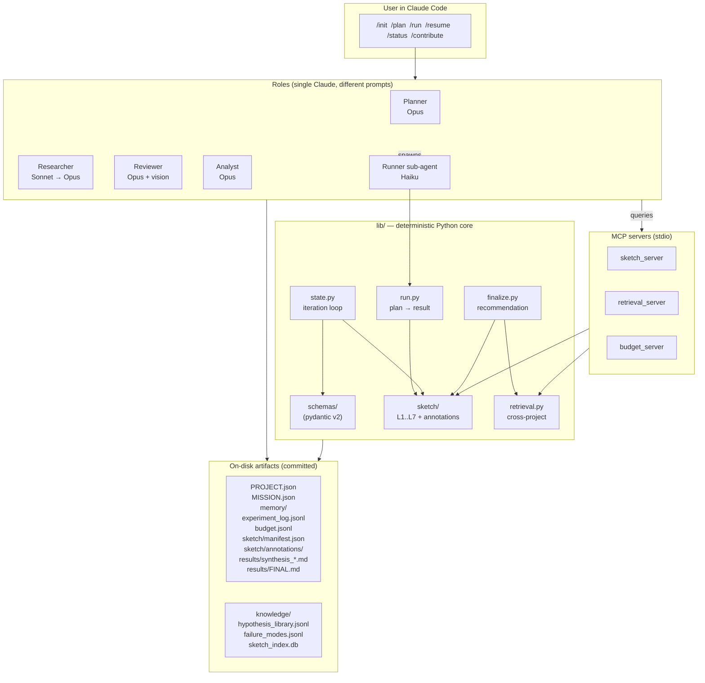

**Key invariant:** every arrow that crosses the LLM/Python boundary
crosses a pydantic-validated schema. The agent's *only* outputs are
plan dicts and prose; the framework's *only* inputs from the agent are
those validated artifacts. No `eval()`, no agent-written data
manipulation.

---

## Feature 1: Capability composition (not problem-type dispatch)

Most ML libraries dispatch on a single problem-type label
(`classification`, `regression`, `forecasting`, …). This explodes into
special-case branches the moment you have a problem that doesn't quite
fit, e.g. *time-ordered* classification with *forecast-horizon* leakage.

This framework declares a **5-tuple capability composition** on every
Mission, and modules dispatch on individual fields:

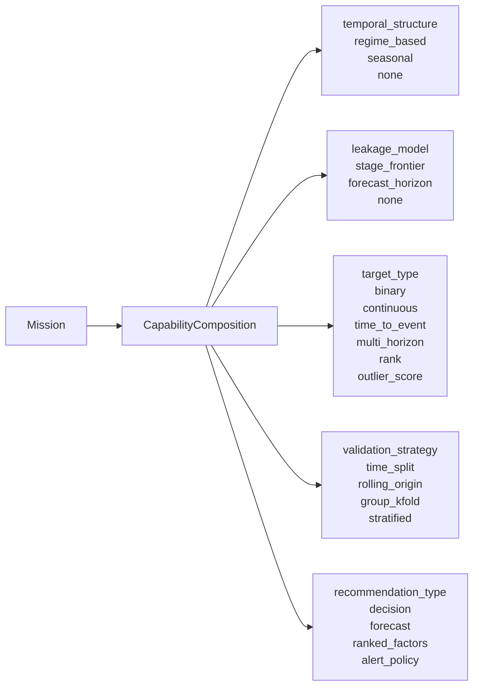

**Validators** (in `lib.schemas.mission`) enforce cross-field rules
that any sane composition must satisfy:

- `target_type=time_to_event` ⇒ `temporal_structure != none`
- `leakage_model=forecast_horizon` ⇒ `temporal_structure != none`
- `target_type=multi_horizon` ⇒ `leakage_model=forecast_horizon`
- `validation_strategy ∈ {time_split, rolling_origin}` ⇒ `temporal_structure != none`

Any inconsistency is rejected at `/plan` lock time, before a single
experiment runs.

**Why it matters:** adding a new problem shape is *additive*. You write
one capability module declaring its `CapabilityComposition`, its
splitter, and its required Mission fields. No existing code changes.

### The 7 v1 capabilities

| Capability                  | Target          | Temporal       | Validation         | Output             |
|-----------------------------|-----------------|----------------|--------------------|--------------------|
| `tabular_classification`    | binary          | none           | stratified         | decision           |
| `tabular_regression`        | continuous      | none           | group_kfold        | ranked_factors     |
| `temporal_classification`   | binary          | regime_based   | time_split         | decision           |
| `forecasting`               | multi_horizon   | seasonal       | rolling_origin     | forecast           |
| `predictive_maintenance`    | time_to_event   | regime_based   | group_kfold        | alert_policy       |
| `anomaly_detection`         | outlier_score   | none           | stratified         | alert_policy       |
| `root_cause_attribution`    | rank            | none           | stratified         | ranked_factors     |

Each registers a **default model set**, **default metric set**, **primary
metric + direction**, **required Mission fields**, and **sketch extras
needed**. The 4-step iteration loop dispatches on the capability key —
not on hand-coded `if problem_type == ...` branches.

---

## Feature 2: Domain modules — pluggable priors

A *domain* injects priors about *what kind of data* is being modeled:
which keywords identify process stages, which columns are typically
downstream-of-target, default join policies, expected interactions,
sensor failure patterns, hard physical bounds, and a small set of
domain-specific seed hypotheses.

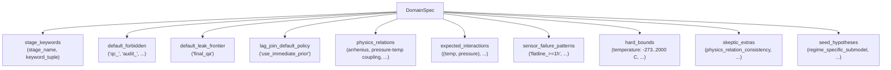

### Three v1 domains

- **`general`** — empty priors. Use it when no domain module fits.
- **`manufacturing`** — process-line manufacturing with stage frontier
  leakage and asof joins. Includes Arrhenius temperature dependence,
  pressure-temperature coupling, and hard physical bounds (0–2000 °C
  for temperature, 0–1000 bar for pressure, etc.).
- **`forecasting_demand`** — calendar / price / inventory features
  for demand forecasting. Validates that the abstraction generalizes
  to a non-manufacturing shape.

Adding a new domain is one file (`lib/domains/<your_domain>.py`) +
one line in `lib/domains/__init__._DOMAIN_MODULES`. See
[`docs/adding_a_domain.md`](docs/adding_a_domain.md).

---

## Feature 3: The Process Data Sketch

The **substrate** of the whole system. A compact (<1MB) summary of any
dataset, built once at `/bootstrap`, queried by the agent via MCP
tools, and updated deterministically after every iteration.

The agent **never reads raw data** — only sketch query results.

```mermaid
flowchart LR
    subgraph Build["build_sketch (deterministic, seeded)"]
        Data["raw_joined.parquet"] --> L1
        Data --> L2
        Data --> L3
        Data --> L4
        Data --> L5
        Data --> L6
        L7Init[("L7 (empty initially)")]
    end

    subgraph Layers["Sketch layers"]
        L1["L1 distributions<br/>quantiles + cardinality + categories"]
        L2["L2 joint<br/>PCA + sparse top-K interactions"]
        L3["L3 regimes<br/>PELT change-points + per-regime mini"]
        L4["L4 coresets<br/>per-capability importance sample"]
        L5["L5 timeseries<br/>SAX + matrix profile"]
        L6["L6 causal<br/>PC-algorithm DAG fragment"]
        L7["L7 failure modes<br/>online Mahalanobis cluster catalog"]
        Ann["annotations/<br/>LLM-written commentary (separate)"]
    end

    L7Init --> L7
    L1 -. "queries" .-> Q[("MCP sketch_server<br/>quantile, distribution,<br/>top_interactions, regimes,<br/>causal_neighbors,<br/>failure_clusters, ...")]
    L2 -. .-> Q
    L3 -. .-> Q
    L5 -. .-> Q
    L6 -. .-> Q
    L7 -. .-> Q

    subgraph Update["After every experiment (deterministic Python, never LLM)"]
        Exp["ExperimentResult"] --> U2["update L2<br/>promote interactions"]
        Exp --> U3["L3 refractory<br/>queue resegmentation"]
        Exp --> U7["update L7<br/>Welford match-or-create"]
    end
```

### Why 7 layers?

Each layer answers a different *kind* of question, and they're cheap
together:

| Layer | Answers                                                                          | Cost  |
|-------|----------------------------------------------------------------------------------|-------|
| L1    | "What does column X look like?"                                                  | tiny  |
| L2    | "Which columns interact?" / "What's the joint structure?"                        | small |
| L3    | "Are there change-points / regimes?"                                             | small |
| L4    | "Give me a representative sample I can fit a baseline on cheaply."               | bounded by sample size |
| L5    | "Are there motifs/discords in this time series?"                                 | small |
| L6    | "What looks causally connected to what?" (under partial-correlation tests)       | small |
| L7    | "What failure modes have I already seen on this dataset?"                        | grows online |

### Determinism + size budget

`build_sketch(..., seed=N)` is bit-identical given (data, seed,
capabilities). `tests/unit/test_sketch_determinism.py` enforces this.
Total structural size (L1+L2+L3+L5+L6+L7 JSON files) for a 5,000-row
dataset: **~30 KB**. The 1MB budget is comfortable headroom for 1000-
column / 10GB-class datasets.

### The annotations layer is *separate*

LLM-written notes (regime labels, failure cluster names, motif
explanations) live under `sketch/annotations/<kind>.jsonl` — and the
structural updaters in `lib.sketch.updaters` **never read them**. This
prevents prose drift from corrupting the structural state.

### MCP tool surface

```
Reads:
  quantile(column, q)          distribution(column)
  cardinality(column)          missingness(column?)
  top_interactions(top_k)      conditional_dependence(a, b, given?)
  principal_components(top_k)  regimes()  regime_compare(a, b)
  motifs(column)               discords(column)
  causal_neighbors(node, k)    confounder_candidates(t, o, k)
  failure_clusters(top_k)      match_residuals(signature)
  fit_quick(cap, features, target)
  cross_validate_quick(cap, features, target, n_splits)

Writes (deterministic Python, never agent):
  update_failure_catalog       update_interactions       refine_regimes
```

---

## Feature 4: The 4-step iteration loop

Every iteration is exactly four steps, every time:

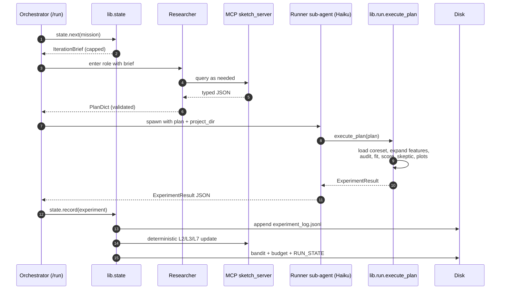

### Step 1 — `state.next(mission)` produces an *IterationBrief*

A capped, JSON-able payload containing everything the researcher needs
and nothing else: capability signature, primary metric + direction +
threshold, best-so-far + best iteration, last 3 experiments,
bandit posteriors, budget fraction consumed, suggested sketch queries
for this capability, and a `termination_imminent` flag.

The brief is *capped* — the researcher's prompt is bounded regardless
of how long the project has been running.

### Step 2 — researcher emits one *PlanDict*

The plan dict's `prior_evidence` field is **mandatory**. Every plan
must reference either a sketch query result, a prior experiment, a
hypothesis seed, or a domain prior. Without this, the framework would
let the agent run experiments unmoored from the sketch — that's the
"random guessing in a fancy hat" failure mode.

```python
{
  "id": "P-7-a3f9b2",
  "iteration": 7,
  "hypothesis_id": "H-iter7-int0",
  "model": "lgbm_binary",
  "features": ["+all_allowed", "engineered:interactions_top5"],
  "params": {"num_leaves": 31},
  "calibrate": true,
  "prior_evidence": {
    "kind": "sketch_query",
    "reference": "top_interactions:abc123",
    "summary": "(reactor_temp, residence_time) MI=0.42, the highest pair"
  },
  "technique_family": "boosted_tree",
  "area": "interactions",
  "expected_info_gain": 0.7
}
```

### Step 3 — the **Runner sub-agent** executes mechanically

The runner is intentionally Haiku — small, cheap, and told to make zero
scientific decisions. It calls one function: `lib.run.execute_plan`.
That function:

1. Loads the per-capability L4 coreset.
2. Expands features through the DSL (see Feature 6).
3. **Audits leakage** — any column in `MISSION.forbidden_columns` used
   outside `area=leakage_probe` fails the audit and the experiment
   short-circuits with verdict=FAIL.
4. Fits the model via `lib.registry`, scores via the capability
   splitter (`lib.capabilities.<key>.make_splitter`), runs metrics via
   `lib.eval.dispatch_metrics`.
5. Runs the **skeptic** — capability-dispatched checks (train/val gap,
   too-good-to-be-true, NaN metrics, metric range).
6. Saves residuals-vs-fitted + a capability-specific diagnostic plot
   under `results/iter_NNN/`.
7. Returns a validated `ExperimentResult`.

### Step 4 — `state.record(experiment)` is everything-at-once

- Appends one row to `experiment_log.jsonl`.
- Computes `is_best_so_far` and `info_gain_actual` (bounded into [0,1]
  for the bandit).
- **Updates L2/L3/L7 deterministically** (see `lib.sketch.updaters`).
- Updates the **bandit posterior** for the experiment's
  `technique_family`.
- Writes a **budget ledger entry** with running totals.
- Atomically updates `RUN_STATE.json` so `/resume` can pick up here.

### Special triggers inside the loop

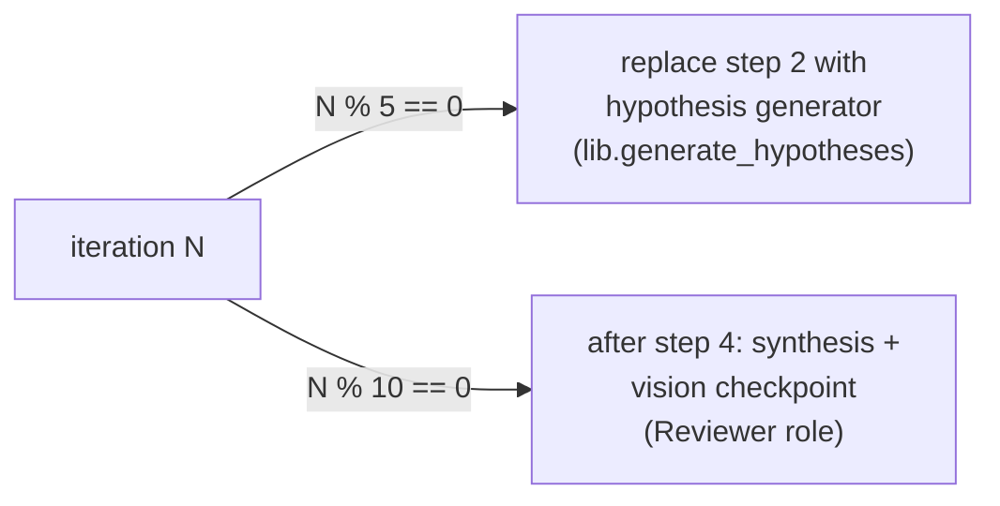

---

## Feature 5: Universal seed hypotheses + cold/warm hypothesis generator

Every project starts with the same five **universal seed hypotheses**:

| Seed   | What                                                                                |
|--------|-------------------------------------------------------------------------------------|
| H-seed-1 | Naive baseline on `+all_allowed` features (anchors metric range)                  |
| H-seed-2 | Univariate champion using top-3 sketch features                                    |
| H-seed-3 | Regime-specific submodels scored on out-of-regime data                             |
| H-seed-4 | Interaction-augmented baseline (top-5 from L2)                                     |
| H-seed-5 | **Leakage probe** — deliberately includes a forbidden column to set the ceiling   |

Plus recipe-specific seeds and domain seeds (each domain module
declares its own — manufacturing adds `lag_join_with_immediate_prior`,
`interaction_temp_pressure`, etc.).

After iteration 5, the **hypothesis generator** kicks in every 5
iterations:

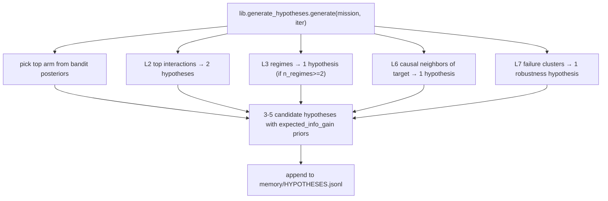

**Why this design?** The generator stays bounded (max 5 hypotheses), is
sketch-grounded (every candidate references a real sketch element),
and respects the bandit (the technique family with the highest
posterior wins ties).

---

## Feature 6: Feature DSL + leakage audit

Plan dicts express features as a list of tokens. The DSL is small and
auditable:

| Token                         | Meaning                                                                                |
|-------------------------------|----------------------------------------------------------------------------------------|
| `+all_allowed`                | Expanded to `MISSION.allowed_columns` (or "everything not in forbidden_columns").       |
| `+lag_downstream`             | Manufacturing-specific lag-join expansion (v1: no-op pending stage map persistence).    |
| `+leak_canary`                | Inserts one forbidden column. Only legal under `area=leakage_probe`.                    |
| `engineered:interactions_top5`| Materializes top-5 L2 interactions as `X__a_x_b` columns.                              |
| `engineered:ratios`           | Pairwise ratios between numeric columns.                                                |
| `engineered:polynomial_2`     | Squared numeric columns.                                                                |
| `engineered:lag_<N>`          | Lag-N versions of numeric columns.                                                      |
| `sketch:top3_univariate`      | Top-3 columns by L2 mutual information.                                                |
| `<bare column name>`          | Verbatim.                                                                               |

After expansion, every plan goes through the **leakage audit**:

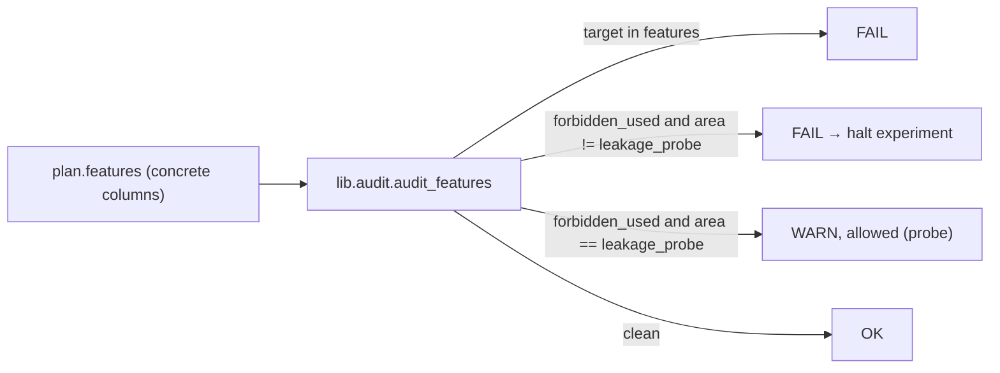

The audit is **strict by default**. The leakage probe (one of the
universal seeds) is the only legal way to use forbidden columns —
explicitly to establish the empirical leakage ceiling.

---

## Feature 7: Skeptic — capability-dispatched, deterministic

After every fit, the skeptic runs a small set of checks and emits
one of:

| Verdict   | Effect                                                              |
|-----------|---------------------------------------------------------------------|
| `ACCEPT`  | Trust the result.                                                   |
| `WARN`    | Caveats noted; experiment still counts.                             |
| `FAIL`    | Result is rejected; in strict mode, repeated FAILs halt the run.   |

### Universal checks (`lib.skeptic`)

- `finite_metric` — `primary_metric_value` is finite.
- `metric_in_range` — e.g., `roc_auc ∈ [0, 1]`.
- `nan_metrics` — no NaN in any per-split metric dict.
- `train_val_gap` — gap on primary metric between train and validation
  splits is below threshold (default 0.25).
- `too_good_to_be_true` — `roc_auc ≥ 0.99` with fewer than 10 features
  is treated as likely leakage. (In strict mode this is a FAIL, not a
  WARN.)

### Per-capability extras

`lib.skeptic._EXTRAS_BY_CAP` dispatches on the capability key. v1 has
extras hooks for `temporal_classification`, `predictive_maintenance`,
and `anomaly_detection` (ready to be filled in as new sanity checks are
identified).

### Domain extras

Domain modules declare `skeptic_extras` (e.g., `physical_bounds_check`,
`sensor_flatline_check`, `physics_relation_consistency`). These are
recorded as advisory warnings (`domain_extra_skipped:<key>`) in v1
because they need raw rows; wiring them to the L4 coreset is a clean
follow-up.

### Catastrophic skeptic-failure termination

`lib.state.termination_check` halts `/run` when the **same skeptic
failure key** fires `catastrophic_failure_window` consecutive iterations
(default 3). This catches the "model is fundamentally broken" failure
mode without burning the entire budget on it.

---

## Feature 8: Bandit + doom-loop detector

### Thompson sampling over technique families

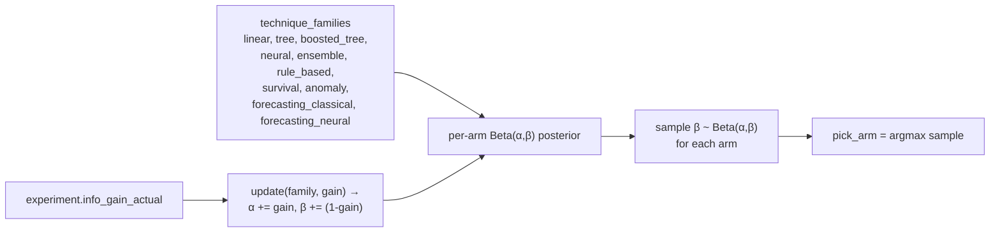

The researcher uses the bandit's recommendation as a **strong prior,
not a hard rule**. Diversification is the researcher's job (the brief
includes `bandit_posteriors` for context); the bandit prevents the
loop from getting stuck on whatever family won iteration 1.

### Doom-loop detector

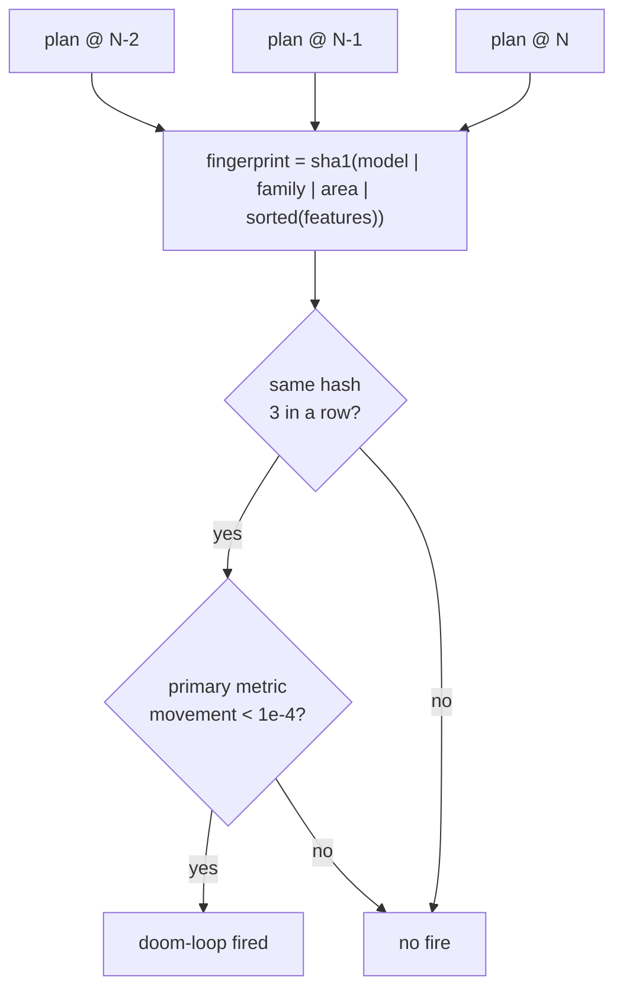

If the doom-loop fires, the orchestrator forces a different `area` /
`technique_family` on the next iteration. Repeated firing without
recovery contributes to catastrophic-stagnation termination.

---

## Feature 9: Synthesis + vision checkpoints (every 10 iterations)

Every 10 iterations, the **Reviewer role** (Opus, vision-enabled) runs:

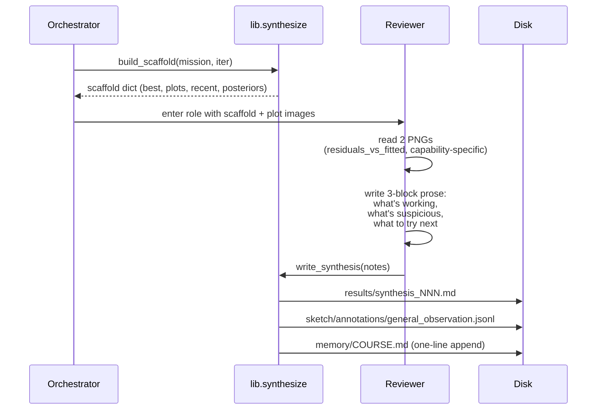

**Plot selection** is deterministic: residuals-vs-fitted on the current
best, plus a capability-specific diagnostic (calibration curve for
classifiers; predicted-vs-actual scatter for regression/forecasting).

**Annotations are commentary**, not state — the structural updaters
never read them, so reviewer prose can never corrupt the sketch.

---

## Feature 10: Counterfactual finalize

`/finalize` produces a `Recommendation` that is **counterfactual-shaped**:
not just "the best model is X", but "if you do X you should expect
effect Y with CI [a,b], and here's what would change this".

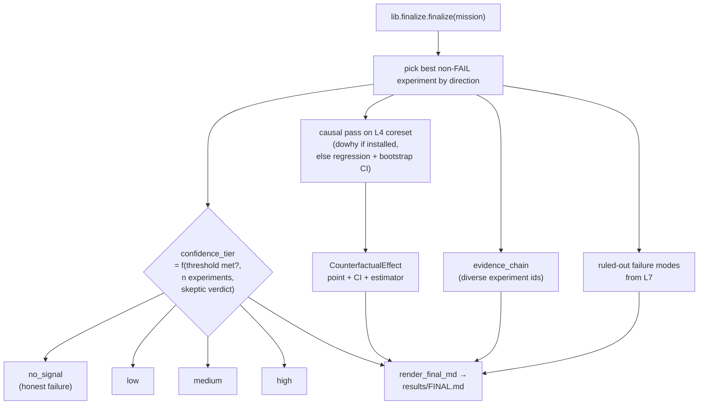

The rendered `FINAL.md` always includes:

- **Decision** (1 sentence). May be the honest-failure form
  ("No actionable signal — collect more data on X").
- **Rationale** (multi-sentence, traceable).
- **Quantified counterfactual** — point estimate + CI + estimator name.
- **Evidence chain** — list of experiment ids that support the
  recommendation, diversified across `area`s.
- **Causal assumptions** — explicit, with optional sensitivity check.
- **Ruled-out failure modes** — drawn from L7 clusters that fired but
  did not invalidate the result.
- **What would change this recommendation** — concrete conditions
  under which the rec retracts.
- **Model card** appendix.

---

## Feature 11: Cross-project knowledge — the compounding flywheel

This is the feature that makes the framework a *platform*, not a
standalone tool.

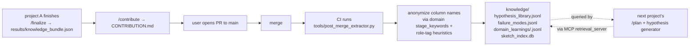

### What gets extracted

- Each non-FAIL experiment with `info_gain_actual >= 0.1` becomes a
  `HypothesisLibraryEntry`.
- Each FAIL `failed_checks` key becomes a `FailureModeEntry`.
- The project's `sketch/manifest.json#similarity_vector` is upserted
  into `sketch_index.db` for cosine-similarity retrieval.

### Anonymization invariants

- **Raw column names never enter `knowledge/`.** Anonymization happens
  at extraction time via `lib.extract_knowledge._anonymize_column`,
  which maps raw names to semantic role tags using:
  - explicit hint patterns (`temp` → `<sensor:temperature>`,
    `flowrate` → `<process:flowrate>`, `demand` → `<outcome:demand>`)
  - domain stage keywords as a fallback (`reactor_inlet_temp` →
    `<stage:reaction>` if no role hint matched)
- **No raw values, no row counts that fingerprint the data.**

### Idempotence

Re-running the extractor on the same project does not duplicate rows:
`entry_id` is constructed from `project + experiment id + check key`.
Knowledge merges are append-only and replay-safe.

### Retrieval

```python
from lib.retrieval import query_similar_projects, query_hypotheses

# Find similar past projects by sketch fingerprint
similar = query_similar_projects(
    workspace=None,
    similarity_vector=current_manifest.similarity_vector,
    domain="manufacturing",
    top_k=5,
)

# Find high-info-gain hypothesis patterns by capability
hyps = query_hypotheses(
    workspace=None,
    domain="manufacturing",
    capability_signature="binary|regime_based|stage_frontier|time_split|decision",
    min_info_gain=0.3,
    top_k=10,
)
```

Both surfaces are also exposed via the **retrieval MCP server**, so the
planner and the hypothesis generator can query them directly.

---

## Feature 12: Replay — bit-identical reproducibility

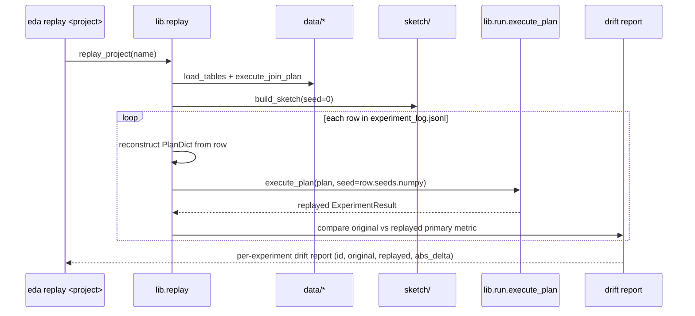

A clean replay has `abs_delta < 1e-6` for every iteration. Any drift is
a determinism bug — surfaced loudly, not silently absorbed.

**Why this matters in an org:**

- **Audit trail.** Anyone with the project repo can reproduce every
  recommended decision. No "the model said it would work" — there's a
  literally-reproducible chain.
- **Bug finding.** A regression in a sketch layer or a metric
  immediately shows up as drift on the next replay run.
- **Migration testing.** When schemas bump, replay confirms the
  migration is value-preserving.

---

## Feature 13: Budget ledger — visible spend

`budget.jsonl` is append-only. Every roleinvocation, bootstrap, synthesis,
and finalize logs a `BudgetLedgerEntry` with running totals, fraction
consumed, and the cap from `MISSION.budget`.

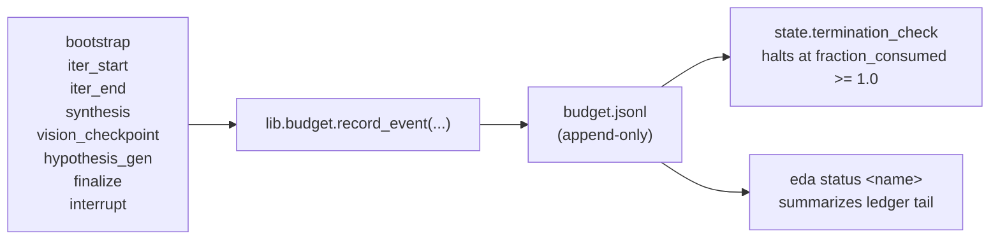

`/run`'s **stagnation window** and **iteration cap** also halt — so a
project never runs unbounded even if the token cap was set generously.

---

## Feature 14: Resumability

Every step writes `RUN_STATE.json` *atomically* (via `tmp + replace`)
with:

- `current_iteration`
- `current_role`
- `last_completed_phase` (`bootstrap`, `iter_N`, `synthesis_N`, `finalize`)
- `best_primary_metric_value` + `best_iteration`
- `iterations_since_improvement`
- `last_regime_split_iteration` (for the L3 anti-flapping guard)

`/resume` reads this file and re-enters `/run` at the right phase. If
the file is missing, `/resume` treats it as a fresh `/run`.

---

## Feature 15: Honest failure as a first-class outcome

Every other feature has been about *finding* signal. This one is about
admitting when there isn't any.

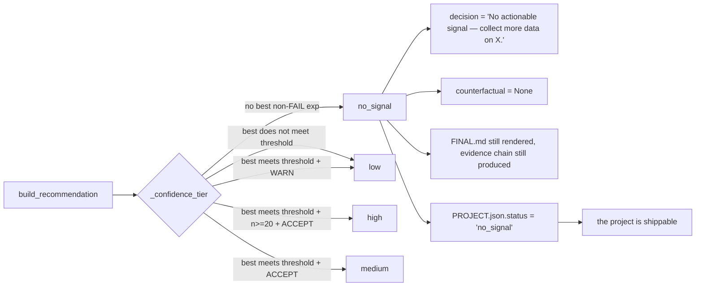

The post-merge extractor records `no_signal` projects' failure modes
just like any other. **The next team to attempt the same dataset shape
inherits the prior team's "we tried; here's what didn't work" body of
evidence.**

This is the difference between an org that re-investigates the same
dead ends every six months and one that doesn't.

---

## Putting it together — the end-to-end flow

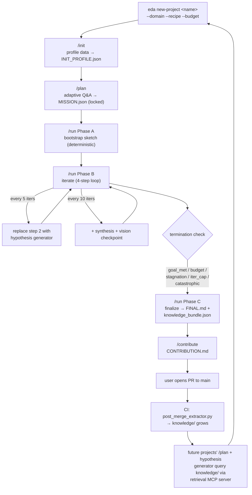

Every box on this diagram corresponds to:

- A pydantic schema in `lib/schemas/` for its inputs/outputs,
- One or more deterministic functions in `lib/`,
- A skill or command file under `.claude/`,
- A test under `tests/`.

That's the contract. That's why it's auditable.

---

## At a glance: 113 tests cover all of this

```
tests/unit/                 77 tests   — schemas, sketch layers, queries,
                                          updaters, eval, registry, audit,
                                          skeptic, bandit, budget, doom-loop,
                                          termination, capabilities, phase 6,
                                          determinism + size budget
tests/integration/           9 tests   — init, planning, bootstrap, iteration,
                                          run-to-goal-met, replay deterministic,
                                          cross-project retrieval, contribute
tests/eval_suites/           9 tests   — planner, researcher, reviewer,
                                          analyst (no live LLM; schema +
                                          heuristic checks)
                            ─────
total                      113 tests   pass in ~17s
```

`tools/audit_repo.py` checks repo health (file size, recipe schema,
universal seed count, MCP server modules) on every PR.

---

## Where to go next

- [`USAGE.md`](USAGE.md) — detailed usage + contributor guide.
- [`docs/quickstart.md`](docs/quickstart.md) — 10-minute walkthrough.
- [`docs/sketch.md`](docs/sketch.md) — the sketch in depth.
- [`docs/agent_roles.md`](docs/agent_roles.md) — role contracts.
- [`docs/capabilities.md`](docs/capabilities.md) +
  [`docs/adding_a_capability.md`](docs/adding_a_capability.md).
- [`docs/domains.md`](docs/domains.md) +
  [`docs/adding_a_domain.md`](docs/adding_a_domain.md).
- [`docs/contributing_knowledge.md`](docs/contributing_knowledge.md) — how
  knowledge merges work end-to-end.
