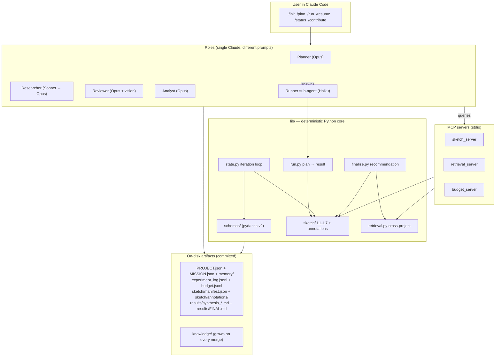
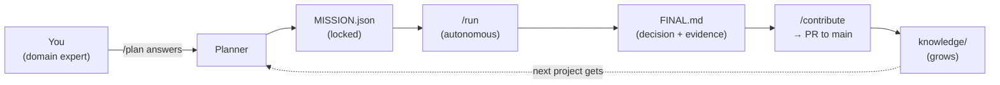
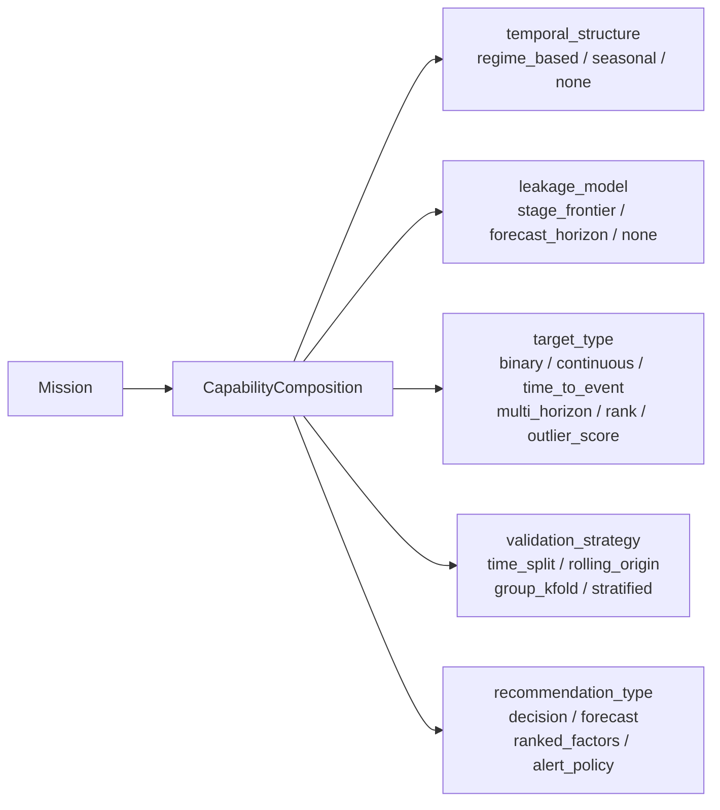
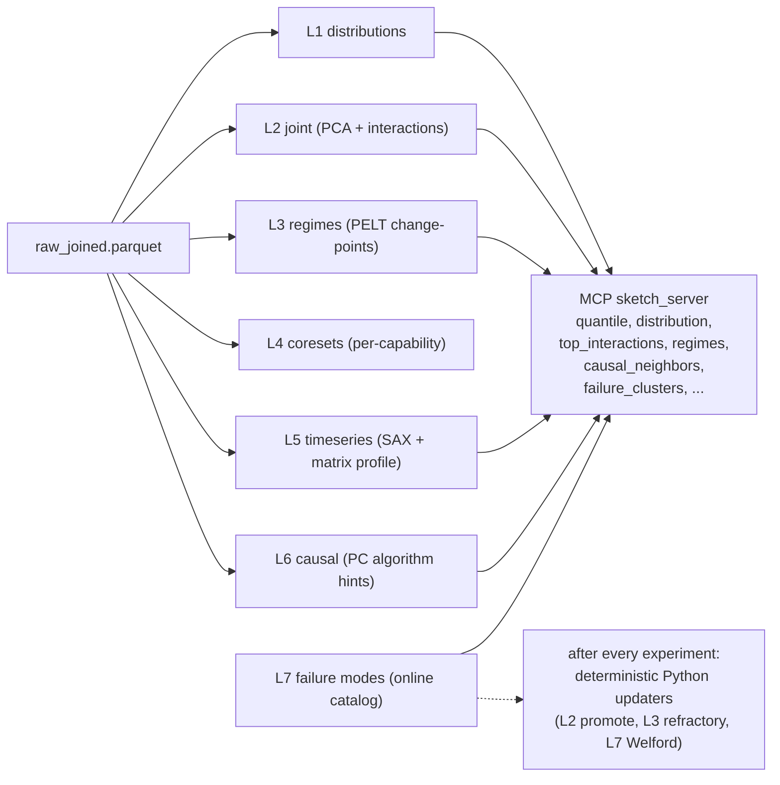
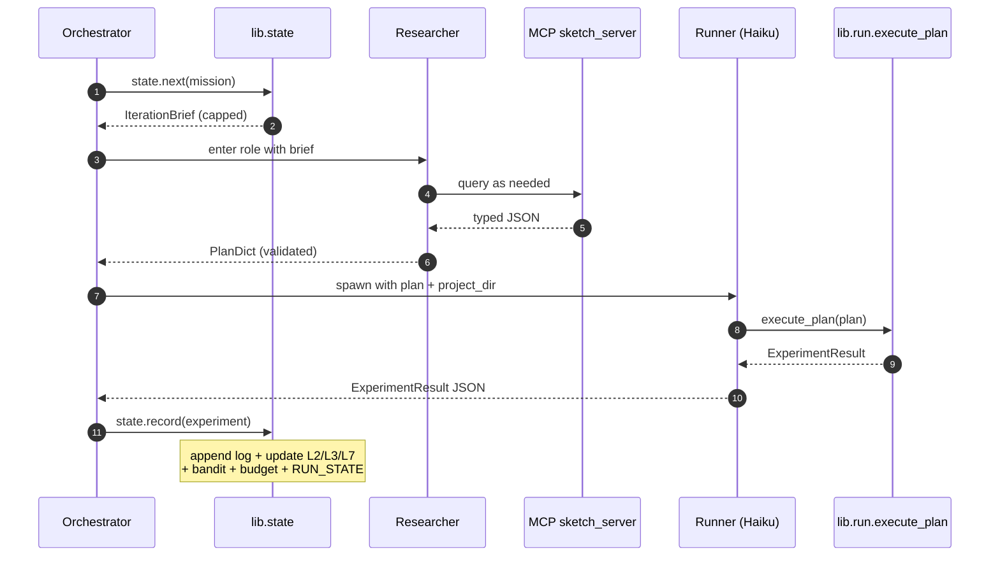
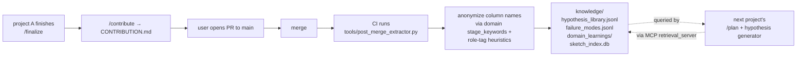

# AgenticEDAModellingTool

> A Claude-Code-native ML platform for end-to-end exploratory data analysis,
> modeling, and hypothesis testing — where every completed project becomes
> organizational knowledge the next project automatically learns from.

[Quickstart](#quickstart)  ·  [Concepts](#core-concepts)  ·  [Slash commands](#slash-commands)  ·  [CLI](#cli-reference)  ·  [Repo layout](#repository-layout)  ·  [Documentation index](#documentation-index)

---

## Table of contents

- [What this is](#what-this-is)
- [The five hard commitments](#the-five-hard-commitments)
- [At a glance](#at-a-glance)
- [Install](#install)
- [Quickstart](#quickstart)
- [Mental model in 60 seconds](#mental-model-in-60-seconds)
- [Core concepts](#core-concepts)
  - [Capability composition](#capability-composition-not-problem-type-dispatch)
  - [Domain modules](#domain-modules)
  - [The Process Data Sketch](#the-process-data-sketch)
  - [The 4-step iteration loop](#the-4-step-iteration-loop)
  - [Hypothesis lifecycle](#hypothesis-lifecycle)
  - [Skeptic + bandit + doom-loop](#skeptic--bandit--doom-loop)
  - [Counterfactual finalize](#counterfactual-finalize)
  - [Cross-project knowledge](#cross-project-knowledge)
  - [Determinism and replay](#determinism-and-replay)
  - [Honest failure as a first-class outcome](#honest-failure-as-a-first-class-outcome)
- [Slash commands](#slash-commands)
- [CLI reference](#cli-reference)
- [Repository layout](#repository-layout)
- [Documentation index](#documentation-index)
- [Status](#status)
- [License](#license)

---

## What this is

Most "agentic ML" tools are a thin LLM wrapper around AutoML — the model
runs experiments, claims a number, and stops. That's a research demo, not
a platform.

This framework is built around five hard commitments that make it useful
inside an organization. The result: a small surface (six slash commands +
five CLI verbs), an auditable trail (every decision traces to an
experiment id or sketch query), and a system that gets *better* at your
data shape with every project that ships.

## The five hard commitments

1. **Determinism is sacred.** Every artifact is reproducible. Replay is
   a first-class operation.
2. **Schemas are the source of truth.** Every artifact — Mission, plan
   dict, experiment row, sketch manifest, recommendation — is a
   pydantic-validated, version-stamped model. The agent reads structured
   state and writes structured outputs.
3. **The agent never reads raw data.** It interacts with a compact
   <1MB *Process Data Sketch* via an MCP tool surface, and delegates plan
   execution to a Haiku sub-agent.
4. **Honest failure is shippable.** "No actionable signal — collect more
   data on X" is a valid project outcome with a defined confidence tier.
5. **Knowledge compounds across projects.** Completed projects merge to
   `main`; CI extracts anonymized patterns into `knowledge/` which future
   projects automatically retrieve from.

## At a glance



Every arrow that crosses the LLM/Python boundary crosses a
pydantic-validated schema. The agent's *only* outputs are plan dicts and
prose; the framework's *only* inputs from the agent are those validated
artifacts. No `eval()`, no agent-written data manipulation.

## Install

```bash
git clone <this repo>
cd AgenticEDAModellingTool
python -m venv .venv
# Windows: .venv\Scripts\activate
# Unix:    source .venv/bin/activate

pip install -e .[dev]
pre-commit install
```

`eda --help` should print all five CLI verbs. See
[`docs/installation.md`](docs/installation.md) for optional MCP support
and the heavy-dependency fallback table.

## Quickstart

```bash
# 1. Create a project (budget is in thousands of tokens; 30 = 30k)
eda new-project my_first --domain manufacturing \
    --recipe manufacturing_defect_classification --budget 30

# 2. Drop your data files (csv, parquet, jsonl) into:
#    projects/my_first/data/

# 3. In Claude Code, change to the project directory:
cd projects/my_first

# 4. Run the slash commands in order:
/init        # profile data, propose joins
/plan        # adaptive Q&A → locked MISSION
/run         # autonomous iteration → FINAL.md
/contribute  # stage the PR that merges learnings into knowledge/
```

For a 10-minute end-to-end synthetic walkthrough, see
[`docs/quickstart.md`](docs/quickstart.md). For three concrete example
projects, see
[`docs/examples/manufacturing_defect_walkthrough.md`](docs/examples/manufacturing_defect_walkthrough.md),
[`docs/examples/demand_forecasting_walkthrough.md`](docs/examples/demand_forecasting_walkthrough.md),
and [`docs/examples/pdm_walkthrough.md`](docs/examples/pdm_walkthrough.md).

## Mental model in 60 seconds



Five things to internalize:

1. **`/plan` is the only place you talk a lot to the agent.** Once
   `MISSION.json` is locked, `/run` is autonomous.
2. **The agent never reads your raw data.** It queries the Process Data
   Sketch via tools.
3. **Every artifact is a validated schema.** `experiment_log.jsonl` is
   not a free-form file — every row passes `ExperimentResult.model_validate`.
4. **Honest failure is shippable.** `confidence_tier="no_signal"` is a
   valid end state.
5. **Knowledge compounds.** Every merged project teaches the next.

For details on each phase, see [`USAGE.md`](USAGE.md) Part 1 or
[`docs/workflow.md`](docs/workflow.md).

---

## Core concepts

### Capability composition (not problem-type dispatch)

Most ML libraries dispatch on a single problem-type label
(`classification`, `regression`, `forecasting`, …). This explodes into
special cases the moment you have a problem that doesn't quite fit, e.g.
*time-ordered* classification with *forecast-horizon* leakage.

This framework declares a **5-tuple capability composition** on every
Mission, and modules dispatch on individual fields:



Validators in `lib/schemas/mission.py` reject inconsistent compositions
at `/plan` lock time, before a single experiment runs.

The 7 v1 capabilities:

| Capability                  | Target          | Temporal       | Validation         | Output             |
|-----------------------------|-----------------|----------------|--------------------|--------------------|
| `tabular_classification`    | binary          | none           | stratified         | decision           |
| `tabular_regression`        | continuous      | none           | group_kfold        | ranked_factors     |
| `temporal_classification`   | binary          | regime_based   | time_split         | decision           |
| `forecasting`               | multi_horizon   | seasonal       | rolling_origin     | forecast           |
| `predictive_maintenance`    | time_to_event   | regime_based   | group_kfold        | alert_policy       |
| `anomaly_detection`         | outlier_score   | none           | stratified         | alert_policy       |
| `root_cause_attribution`    | rank            | none           | stratified         | ranked_factors     |

Adding a new capability is one file + one line in the registry —
existing code does not change.

→ deeper: [`docs/capabilities.md`](docs/capabilities.md), [`docs/adding_a_capability.md`](docs/adding_a_capability.md), [`FEATURES.md#feature-1-capability-composition-not-problem-type-dispatch`](FEATURES.md#feature-1-capability-composition-not-problem-type-dispatch)

### Domain modules

A *domain* injects priors about *what kind of data* is being modeled:
which keywords identify process stages, which columns are typically
downstream-of-target, default join policies, expected interactions,
sensor failure patterns, hard physical bounds, and a small set of
domain-specific seed hypotheses.

The 3 v1 domains:

- **`general`** — empty priors. Fallback when no domain fits.
- **`manufacturing`** — process-line manufacturing with stage-frontier
  leakage and asof joins. Includes Arrhenius and pressure-temperature
  physics priors plus hard physical bounds.
- **`forecasting_demand`** — calendar / price / inventory features.
  Validates that the abstraction generalizes to non-manufacturing.

Adding a new domain: copy [`lib/domains/_template.py`](lib/domains/_template.py),
fill in the spec, register one line.

→ deeper: [`docs/domains.md`](docs/domains.md), [`docs/adding_a_domain.md`](docs/adding_a_domain.md)

### The Process Data Sketch

The **substrate** of the whole system. A compact (<1MB) summary of any
dataset, built once at `/bootstrap`, queried by the agent via MCP tools,
and updated deterministically after every iteration. **The agent never
reads raw data.**



The annotations layer (`sketch/annotations/`) holds LLM-written
commentary, but the structural updaters **never read it** — prose drift
cannot corrupt structural state.

Total structural size for a 5,000-row dataset: **~30 KB**. Determinism is
enforced: the same data + seed produces a bit-identical manifest.

→ deeper: [`docs/sketch.md`](docs/sketch.md), [`FEATURES.md#feature-3-the-process-data-sketch`](FEATURES.md#feature-3-the-process-data-sketch)

### The 4-step iteration loop

Every iteration is exactly four steps, every time:



Two special triggers:
- **Every 5 iterations:** the hypothesis generator replaces step 2,
  drawing 3-5 new hypotheses from the sketch + bandit.
- **Every 10 iterations:** synthesis + vision checkpoint (Reviewer role
  reads two plot images and writes prose).

`/run` terminates only on **goal_met / budget_exhausted / stagnation /
catastrophic_skeptic / iteration_cap / user_interrupt**.

→ deeper: [`docs/workflow.md`](docs/workflow.md), [`FEATURES.md#feature-4-the-4-step-iteration-loop`](FEATURES.md#feature-4-the-4-step-iteration-loop)

### Hypothesis lifecycle

Every project starts with five **universal seed hypotheses**:

| Seed   | What                                                                     |
|--------|--------------------------------------------------------------------------|
| H-seed-1 | Naive baseline on `+all_allowed` (anchors metric range)                |
| H-seed-2 | Univariate champion using top-3 sketch features                         |
| H-seed-3 | Regime-specific submodels scored on out-of-regime data                  |
| H-seed-4 | Interaction-augmented baseline (top-5 from L2)                          |
| H-seed-5 | **Leakage probe** — deliberately includes a forbidden column            |

Plus recipe-specific seeds and per-domain seeds. After iteration 5,
`lib/generate_hypotheses.py` produces 3-5 new sketch-grounded
hypotheses every 5 iterations (drawing from L2 interactions, L3 regimes,
L6 causal neighbors, and L7 failure clusters).

Every plan the researcher emits **must** carry a `prior_evidence` field
referencing a sketch query, prior experiment, hypothesis seed, or domain
prior. This is the wall against unmoored experimentation.

→ deeper: [`seeds/universal_seeds.jsonl`](seeds/universal_seeds.jsonl), [`FEATURES.md#feature-5-universal-seed-hypotheses--coldwarm-hypothesis-generator`](FEATURES.md#feature-5-universal-seed-hypotheses--coldwarm-hypothesis-generator)

### Skeptic + bandit + doom-loop

Three deterministic guardrails layered on the iteration loop:

- **Skeptic** (`lib/skeptic.py`) — capability-dispatched checks emit
  `ACCEPT` / `WARN` / `FAIL`. Universal checks include `finite_metric`,
  `metric_in_range`, `train_val_gap`, `too_good_to_be_true_likely_leakage`.
  Repeated FAIL on the same key triggers catastrophic-skeptic
  termination.
- **Bandit** (`lib/bandit.py`) — Thompson sampling over technique
  families with Beta(α, β) posteriors per arm. The researcher uses it as
  a strong prior, not a hard rule.
- **Doom-loop detector** (`lib/doom_loop.py`) — fingerprints the last 3
  plans and the last 3 metric values; fires when both are flat. Forces
  the orchestrator to demand a different `area` or `technique_family`.

→ deeper: [`FEATURES.md#feature-7-skeptic--capability-dispatched-deterministic`](FEATURES.md#feature-7-skeptic--capability-dispatched-deterministic), [`FEATURES.md#feature-8-bandit--doom-loop-detector`](FEATURES.md#feature-8-bandit--doom-loop-detector)

### Counterfactual finalize

`/finalize` produces a **counterfactual-shaped** Recommendation: not
just "the best model is X" but "if you do X you should expect effect Y
with CI [a, b], and here's what would change this".

Every `FINAL.md` always contains:

1. **Confidence tier** (`high` / `medium` / `low` / `no_signal`).
2. **Decision** — one sentence.
3. **Rationale** — multi-sentence, traceable.
4. **Quantified counterfactual** — point estimate + CI + estimator.
5. **Evidence chain** — diversified experiment ids supporting the rec.
6. **Causal assumptions** — explicit, with optional sensitivity check.
7. **Ruled-out failure modes** — drawn from L7 clusters.
8. **What would change this recommendation** — concrete retraction conditions.
9. **Model card** appendix.

The causal pass uses `dowhy` if installed, with a bootstrap-CI'd
multivariate regression as fallback.

→ deeper: [`FEATURES.md#feature-10-counterfactual-finalize`](FEATURES.md#feature-10-counterfactual-finalize), [`docs/replay.md`](docs/replay.md)

### Cross-project knowledge

The compounding flywheel that makes the framework a *platform*, not a
standalone tool:



Anonymization invariants:
- Raw column names never enter `knowledge/`. They are mapped to
  semantic role tags (`<sensor:temperature>`, `<process:flowrate>`,
  `<outcome:demand>`, …).
- No raw values, no row counts that fingerprint the data.
- Idempotent: re-running the extractor never duplicates rows.

→ deeper: [`docs/contributing_knowledge.md`](docs/contributing_knowledge.md), [`knowledge/README.md`](knowledge/README.md), [`FEATURES.md#feature-11-cross-project-knowledge--the-compounding-flywheel`](FEATURES.md#feature-11-cross-project-knowledge--the-compounding-flywheel)

### Determinism and replay

`eda replay <project>` reads `experiment_log.jsonl` plus the framework
version pinned in `PROJECT.json` and reproduces every artifact:

```
{
  "id": "P-7-abc",
  "primary_metric": "roc_auc",
  "original": 0.812,
  "replayed": 0.812,
  "abs_delta": 0.0
}
```

A clean replay has `abs_delta < 1e-6` for every iteration. Any drift is
a determinism bug — surfaced loudly, not silently absorbed.

This is what makes the framework auditable: anyone with the project
repo can reproduce every recommended decision.

→ deeper: [`docs/replay.md`](docs/replay.md), [`FEATURES.md#feature-12-replay--bit-identical-reproducibility`](FEATURES.md#feature-12-replay--bit-identical-reproducibility)

### Honest failure as a first-class outcome

When the data is too thin, the framework still ships a useful artifact:

> **Confidence tier:** `no_signal`
>
> **Decision:** No actionable signal — collect more data on
> `<sensor:temperature>` and `<process:flowrate>`.
>
> **Rationale:** Best run was iter 18 with `roc_auc = 0.58` (threshold
> 0.78). Skeptic ACCEPT throughout; not a quality issue, a signal one.

This is **a valid PR**. The post-merge extractor records the failure
modes, and the next team to attempt the same dataset shape inherits
this evidence. That's the difference between an org that re-investigates
the same dead ends every six months and one that doesn't.

---

## Slash commands

The framework uses six slash commands. Each has a strict contract in
`.claude/commands/<name>.md`. Run them inside Claude Code from the
project directory.

| Command       | Purpose                                                       | Detailed reference                                          |
|---------------|---------------------------------------------------------------|-------------------------------------------------------------|
| `/init`       | Profile data → `INIT_PROFILE.json` + init report. Asks no Qs. | [USAGE.md §4.1](USAGE.md#41-init--pure-inspection)          |
| `/plan`       | Adaptive Q&A → locked MISSION + seeded HYPOTHESES.            | [USAGE.md §4.2](USAGE.md#42-plan--adaptive-qa--locked-mission) |
| `/run`        | Autonomous bootstrap → iterate → finalize.                    | [USAGE.md §4.3](USAGE.md#43-run--autonomous-iteration)      |
| `/resume`     | Pick up an interrupted `/run` from `RUN_STATE.json`.          | [USAGE.md §4.4](USAGE.md#44-resume--pick-up-an-interrupted-run) |
| `/status`     | Print compact project state + budget consumption.             | [USAGE.md §4.5](USAGE.md#45-status--current-project-state)  |
| `/contribute` | Stage `CONTRIBUTION.md` + git commands for the merge PR.      | [USAGE.md §4.6](USAGE.md#46-contribute--prepare-the-merge-pr) |

## CLI reference

Five verbs cover everything outside Claude Code:

| Verb              | Purpose                                                                  |
|-------------------|--------------------------------------------------------------------------|
| `eda new-project` | Create a project under `projects/<name>/` from a template + recipe.      |
| `eda list`        | Tabular listing of every project's status + confidence tier.             |
| `eda status`      | Per-project summary of `PROJECT.json` + experiment count + budget tail.  |
| `eda library`     | Inspect cross-project `knowledge/` (filterable by domain, capability).   |
| `eda replay`      | Deterministically replay a project's experiment log + report drift.      |

Full options: `eda <verb> --help` or [USAGE.md §5](USAGE.md#5-cli-reference).

---

## Repository layout

```
AgenticEDAModellingTool/
├── README.md                  # this file
├── USAGE.md                   # detailed usage + contributor guide
├── FEATURES.md                # deep capability tour with diagrams
├── CHANGELOG.md
├── pyproject.toml             # package metadata + pinned deps
├── requirements.txt
├── eda                        # CLI entry shim
├── .claude/                   # the agent's brain
│   ├── commands/              #   /init, /plan, /run, /resume, /status, /contribute
│   ├── agents/                #   runner.md (Haiku sub-agent)
│   └── skills/                #   planner, researcher, reviewer, analyst, runner
├── lib/                       # deterministic Python core
│   ├── schemas/               #   pydantic v2 models for every artifact
│   ├── capabilities/          #   7 capability modules + base + registry
│   ├── domains/               #   general, manufacturing, forecasting_demand
│   ├── sketch/                #   builder, L1..L7, annotations, queries, similarity
│   ├── inspect.py planning.py lock.py        # /init, /plan, lock
│   ├── data.py features.py audit.py          # data + DSL + leakage gate
│   ├── eval.py registry.py skeptic.py        # metrics, models, skeptic
│   ├── run.py state.py budget.py bandit.py   # iteration loop machinery
│   ├── doom_loop.py
│   ├── generate_hypotheses.py synthesize.py finalize.py    # Phase 6
│   ├── retrieval.py extract_knowledge.py contribute.py replay.py
│   ├── project.py workspace.py cli.py
│   └── __init__.py            # __version__, SCHEMA_VERSION
├── mcp_servers/               # stdio MCP servers (sketch, retrieval, budget)
├── seeds/                     # universal_seeds.jsonl (the 5 seed hypotheses)
├── recipes/                   # 7 pre-validated MISSION templates
├── knowledge/                 # cross-project knowledge (grows on every merge)
├── projects/                  # per-project workspaces (project/<team>/<name> branches)
│   └── .templates/_project_template/    # skeleton copied at creation
├── tools/                     # post_merge_extractor, audit_repo, replay_runner, migrate_schema
├── tests/                     # 113 tests
│   ├── unit/                  #   schemas, sketch, eval, registry, audit, skeptic,
│   │                          #   bandit, budget, doom-loop, termination, capabilities,
│   │                          #   determinism + size budget
│   ├── integration/           #   init, planning, bootstrap, iteration, run-to-goal,
│   │                          #   replay, cross-project, contribute
│   ├── eval_suites/           #   planner, researcher, reviewer, analyst (no live LLM)
│   └── fixtures/
├── docs/                      # topic-specific deep dives
│   ├── installation.md quickstart.md workflow.md
│   ├── capabilities.md domains.md recipes.md sketch.md agent_roles.md
│   ├── budget.md replay.md troubleshooting.md
│   ├── adding_a_capability.md adding_a_domain.md
│   ├── contributing_code.md contributing_knowledge.md
│   └── examples/              # three end-to-end walkthroughs
└── .pre-commit-config.yaml
```

Per-project on-disk layout (under `projects/<name>/`):

```
PROJECT.json                  status, budget, framework version pin
MISSION.json                  the locked agreement
memory/                       INIT_PROFILE, COLUMNS, JOIN_PLAN, HYPOTHESES, COURSE.md, BANDIT.json
data/                         (gitignored) raw user files
sketch/                       manifest.json (committed) + L1..L7 (gitignored) + annotations/
results/                      iter_NNNN/ (gitignored) + synthesis_NNNN.md + FINAL.md + knowledge_bundle.json
experiment_log.jsonl          append-only ExperimentResult rows
budget.jsonl                  append-only BudgetLedgerEntry rows
RUN_STATE.json                atomic resume cursor
```

---

## Documentation index

The README covers the headline material. For the next level of detail
on any topic, the relevant doc is below.

### Top-level guides

| Doc                                  | When to read it                                                            |
|--------------------------------------|----------------------------------------------------------------------------|
| [`USAGE.md`](USAGE.md)               | Detailed usage + contributor guide. Part 1 = how to use; Part 2 = how to contribute. |
| [`FEATURES.md`](FEATURES.md)         | Deep tour of every feature with 14 diagrams. The "explain how good this is" doc. |
| [`CHANGELOG.md`](CHANGELOG.md)       | Versioned changes + known limitations.                                     |

### Getting started

| Doc                                                | What it covers                                                |
|----------------------------------------------------|---------------------------------------------------------------|
| [`docs/installation.md`](docs/installation.md)     | Setup, dependencies, optional `mcp` extra, fallback table.    |
| [`docs/quickstart.md`](docs/quickstart.md)         | 10-minute end-to-end synthetic walkthrough.                   |
| [`docs/workflow.md`](docs/workflow.md)             | Phase-by-phase reference (`/init` → `/plan` → `/run` → `/contribute`). |

### Concepts

| Doc                                                | What it covers                                                |
|----------------------------------------------------|---------------------------------------------------------------|
| [`docs/sketch.md`](docs/sketch.md)                 | The Process Data Sketch in depth: L1..L7, MCP surface, determinism, size budget. |
| [`docs/capabilities.md`](docs/capabilities.md)     | The 7 capabilities, when to use which.                        |
| [`docs/domains.md`](docs/domains.md)               | Domain priors and when to add a new one.                      |
| [`docs/recipes.md`](docs/recipes.md)               | The 7 pre-validated `MISSION` templates.                      |
| [`docs/agent_roles.md`](docs/agent_roles.md)       | Each role's spec and behavior (Planner, Researcher, Reviewer, Analyst, Runner). |
| [`docs/budget.md`](docs/budget.md)                 | Budget mechanics; tuning per project.                         |
| [`docs/replay.md`](docs/replay.md)                 | Reproducibility, replay, drift reports.                       |

### Examples

| Doc                                                                                                  | Example                              |
|------------------------------------------------------------------------------------------------------|--------------------------------------|
| [`docs/examples/manufacturing_defect_walkthrough.md`](docs/examples/manufacturing_defect_walkthrough.md) | Defect classification on a process line.  |
| [`docs/examples/demand_forecasting_walkthrough.md`](docs/examples/demand_forecasting_walkthrough.md)     | Demand forecasting with calendar/price.   |
| [`docs/examples/pdm_walkthrough.md`](docs/examples/pdm_walkthrough.md)                                   | Predictive maintenance / time-to-event.   |

### Contributing

| Doc                                                                  | What it covers                                          |
|----------------------------------------------------------------------|---------------------------------------------------------|
| [`USAGE.md` Part 2](USAGE.md#part-2--contributing)                   | The contributor guide (setup, branching, testing, pre-PR checklist). |
| [`docs/contributing_code.md`](docs/contributing_code.md)             | Style + branching + testing summary.                    |
| [`docs/contributing_knowledge.md`](docs/contributing_knowledge.md)   | The other kind of PR: how knowledge merges propagate.   |
| [`docs/adding_a_capability.md`](docs/adding_a_capability.md)         | Step-by-step: add a new capability module.              |
| [`docs/adding_a_domain.md`](docs/adding_a_domain.md)                 | Step-by-step: add a new domain module.                  |

### Per-area README

| Doc                                                | What it covers                                                |
|----------------------------------------------------|---------------------------------------------------------------|
| [`projects/README.md`](projects/README.md)         | Per-project committed vs. gitignored artifacts.               |
| [`knowledge/README.md`](knowledge/README.md)       | The cross-project knowledge layout + anonymization invariants. |

### Operations

| Doc                                                | What it covers                                                |
|----------------------------------------------------|---------------------------------------------------------------|
| [`docs/troubleshooting.md`](docs/troubleshooting.md) | Common failures and fixes.                                  |

---

## Status

This is **v1**. All 113 tests pass:

```
tests/unit/                 77 tests   schemas, sketch (layers + queries +
                                       updaters + determinism), eval, registry,
                                       audit, skeptic, bandit, budget,
                                       doom-loop, termination, capabilities, phase 6
tests/integration/           9 tests   init, planning, bootstrap, iteration,
                                       run-to-goal-met, replay deterministic,
                                       cross-project retrieval, contribute
tests/eval_suites/           9 tests   planner, researcher, reviewer, analyst
                                       (schema + heuristic checks; no live LLM)
                            ─────
total                      113 tests   pass in ~17s
```

`tools/audit_repo.py` reports OK on every commit (file size, recipe schemas,
universal seed count, MCP server module presence).

Heavy optional dependencies (lightgbm, stumpy, dowhy, lifelines, ruptures)
all have well-tested fallbacks; the framework installs and runs cleanly
with just the core dependencies. See [`docs/installation.md`](docs/installation.md)
for the fallback table.

---

## License

Proprietary (internal). See package metadata in
[`pyproject.toml`](pyproject.toml).
