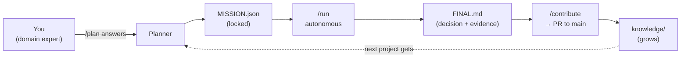
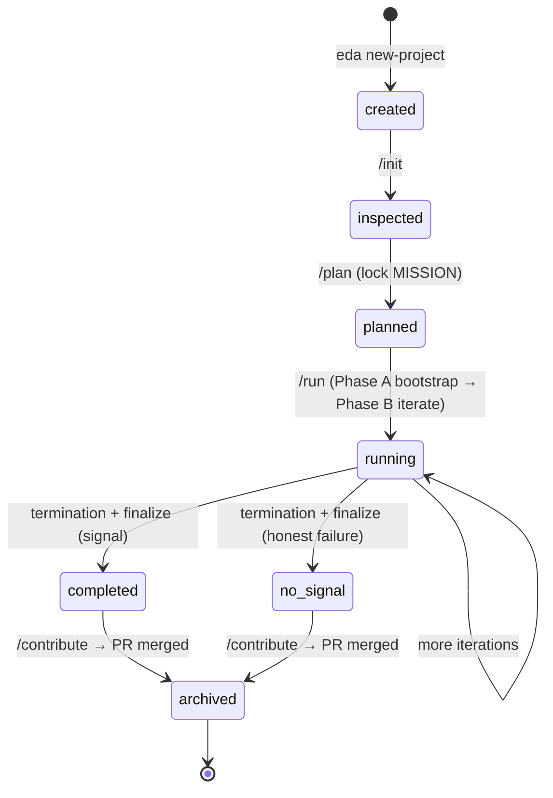
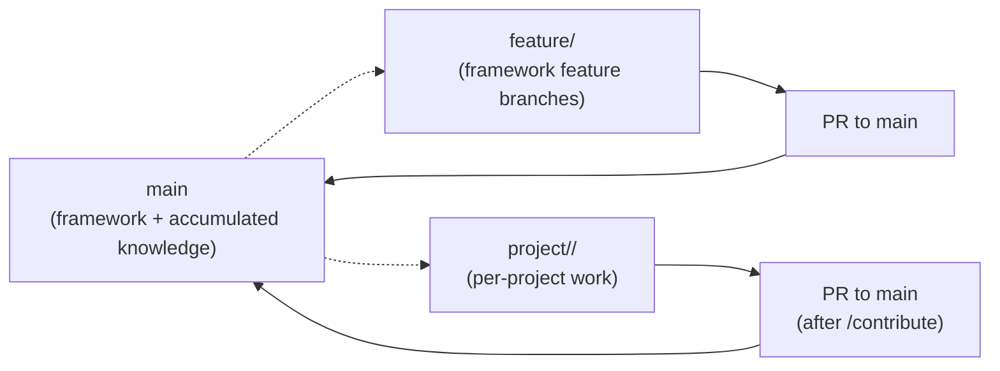
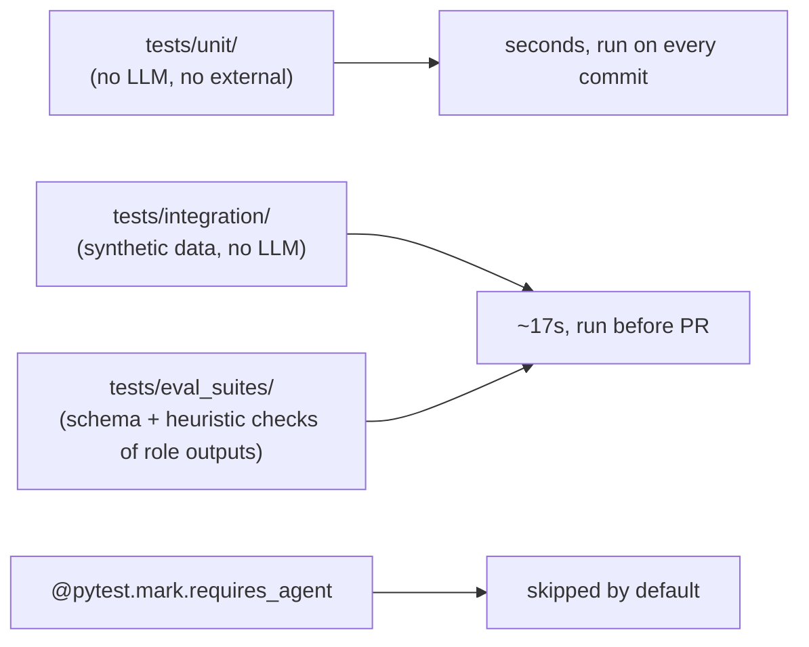
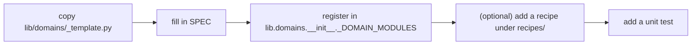
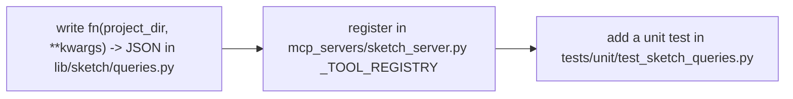

# EDA Framework — Usage & Contributor Guide

How to use the framework end-to-end, then how to extend or contribute
to it. Pair with [`FEATURES.md`](FEATURES.md) for the deep "what does
this do and why" tour.

---

## Table of contents

- [Part 1 — Using the tool](#part-1--using-the-tool)
  - [Install](#1-install)
  - [Mental model in 60 seconds](#2-mental-model-in-60-seconds)
  - [Project lifecycle, end-to-end](#3-project-lifecycle-end-to-end)
  - [Slash commands in detail](#4-slash-commands-in-detail)
  - [CLI reference](#5-cli-reference)
  - [Reading the artifacts](#6-reading-the-artifacts-what-each-file-tells-you)
  - [Resume, replay, debug](#7-resume-replay-debug)
  - [Working across multiple projects](#8-working-across-multiple-projects)
  - [Tuning the budget](#9-tuning-the-budget)
  - [Common usage patterns](#10-common-usage-patterns)
- [Part 2 — Contributing](#part-2--contributing)
  - [Setup](#11-setup)
  - [Branching](#12-branching)
  - [Code style](#13-code-style)
  - [Testing discipline](#14-testing-discipline)
  - [Adding a capability](#15-adding-a-capability)
  - [Adding a domain](#16-adding-a-domain)
  - [Adding a recipe](#17-adding-a-recipe)
  - [Adding a skeptic check](#18-adding-a-skeptic-check)
  - [Adding a sketch query](#19-adding-a-sketch-query-mcp)
  - [Editing a skill or command file](#20-editing-a-skill-or-command-file)
  - [Schema migrations](#21-schema-migrations)
  - [Knowledge contributions](#22-knowledge-contributions-the-other-kind-of-pr)
  - [Pre-PR checklist](#23-pre-pr-checklist)

---

# Part 1 — Using the tool

## 1. Install

### Requirements

- Python 3.10+ (3.11 recommended).
- pip ≥ 22.
- A local Claude Code install (the slash commands and sub-agent only
  fire from inside Claude Code).

### Steps

```bash
git clone <this repo>
cd eda-framework
python -m venv .venv
# Windows:
.venv\Scripts\activate
# Unix:
source .venv/bin/activate

pip install -e .[dev]
pre-commit install
```

After install, `eda --help` should show all five CLI verbs:

```
new-project   create a project under projects/
list          list known projects
status        show one project's status
library       inspect cross-project knowledge
replay        deterministically replay a project
```

### Optional MCP integration

```bash
pip install -e .[mcp]
```

Without `mcp`, the sketch / retrieval / budget servers fall back to a
line-based JSON-RPC stdio protocol that's still usable from tests and
scripts.

### Heavy optional dependencies (all have fallbacks)

| Package      | Used by                                 | Fallback                                     |
|--------------|-----------------------------------------|----------------------------------------------|
| `lightgbm`   | boosted-tree models                     | sklearn `GradientBoosting{Classifier,Regressor}` |
| `stumpy`     | L5 matrix profile                       | sliding-mean motif/discord                   |
| `dowhy`      | counterfactual ATE in finalize          | bootstrap-CI'd multivariate regression       |
| `lifelines`  | Cox PH for `predictive_maintenance`     | ridge regressor on event times               |
| `ruptures`   | L3 PELT change-point detection          | CUSUM detector                               |

---

## 2. Mental model in 60 seconds



**Five things to internalize:**

1. **`/plan` is the *only* place you talk a lot to the agent.** Once
   `MISSION.json` is locked, `/run` is autonomous.
2. **The agent never reads your raw data.** It queries the Process Data
   Sketch via tools.
3. **Every artifact is a validated schema.** `experiment_log.jsonl` is
   not a free-form file — every row passes `ExperimentResult.model_validate`.
4. **Honest failure is shippable.** `confidence_tier="no_signal"` is a
   valid project end state.
5. **Knowledge compounds.** Every merged project teaches the next one.

---

## 3. Project lifecycle, end-to-end



`PROJECT.json.status` reflects the current state; `eda status <name>`
prints it.

---

## 4. Slash commands in detail

The framework uses six slash commands. Each is a separate Claude Code
"role" with a strict contract in `.claude/commands/<name>.md`.

### 4.1 `/init` — pure inspection

**What it does.** Reads every supported file under `data/` (csv, parquet,
jsonl), profiles each column (dtype, missingness, cardinality, top
values, datetime range), detects likely target / time / id columns,
proposes joins between tables sharing key-like columns. Writes
`memory/INIT_PROFILE.json` and `results/init_report.md`.

**What it does NOT do.** Ask questions, modify MISSION, write any
Python that touches data outside `lib.inspect`.

**When it errors out.** No `data/` folder, no supported files, every
file fails to parse. Errors are reported verbatim.

**You should run `/init` if:**

- You're starting a new project.
- You've added new files to `data/`.
- You want a refresher on what columns are present.

---

### 4.2 `/plan` — adaptive Q&A → locked MISSION

**What it does.** Loads `INIT_PROFILE.json`, the recipe (if any), and
the domain priors. Builds a question batch where every question is
either:

- A **confirm-inference** (the planner has a high-confidence guess; you
  press enter to accept), or
- A **free-text** question for things the planner can't infer
  (business question, custom thresholds).

After all batches are answered, it calls `assemble_mission(...)` and
`lock_project(...)`. **Both validate strictly**: an inconsistent
composition or missing required field becomes a focused follow-up
question, not a silently-filled default.

**What's in the locked MISSION:**

- The 5-tuple `CapabilityComposition`.
- `target_column`, `time_column`, `group_column`.
- `forbidden_columns` (downstream-of-target / leakage risk).
- `allowed_columns` (whitelist; empty = "everything not forbidden").
- `success_criterion` (metric, threshold, direction, on_split).
- `budget` (token_cap, iteration_cap, stagnation_window, catastrophic_failure_window).
- `business_question` (1-sentence, used by the analyst at finalize).
- `join_plan` (ordered `JoinSpec` list).

**You should re-run `/plan` only if MISSION needs to change.** Locking
twice is a smell — usually it means the data changed and you should
also re-run `/init`.

---

### 4.3 `/run` — autonomous iteration

This is the one slash command you use day-to-day after planning.

**Phase A — Bootstrap.** Loads the raw tables, executes the join plan,
persists `sketch/raw_joined.parquet`, builds the full sketch with
`seed=0`. Idempotent: if `sketch/manifest.json` exists, bootstrap is
skipped.

**Phase B — Iterate.** The 4-step loop, with two special triggers:

```mermaid
gantt
    title Iteration triggers (per 30 iterations)
    dateFormat X
    axisFormat %s
    section every iter
    state.next + researcher + runner + record  :a, 0, 30
    section every 5 iters
    hypothesis generator                       :b, 5, 1
    hypothesis generator                       :c, 10, 1
    hypothesis generator                       :d, 15, 1
    hypothesis generator                       :e, 20, 1
    hypothesis generator                       :f, 25, 1
    hypothesis generator                       :g, 30, 1
    section every 10 iters
    synthesis + vision checkpoint              :h, 10, 1
    synthesis + vision checkpoint              :i, 20, 1
    synthesis + vision checkpoint              :j, 30, 1
```



Per iteration, the orchestrator outputs **one short progress line** in
the chat:

```
iter 7 / 100 (12% budget) — area=interactions model=lgbm_binary roc_auc=0.81 ✓
```

After every synthesis, a 2-3 line summary. After finalize, the
confidence tier + path to FINAL.md.

**Phase C — Finalize.** Runs the analyst role, builds the
`Recommendation`, writes `results/FINAL.md` and
`results/knowledge_bundle.json`, bumps `PROJECT.json.status`.

**Termination conditions** (any one halts the loop):

| Condition                      | When it fires                                                |
|--------------------------------|--------------------------------------------------------------|
| `goal_met`                     | `success_criterion` satisfied on `on_split`                  |
| `budget_exhausted`             | `cumulative_total >= budget.token_cap`                       |
| `stagnation`                   | `iterations_since_improvement >= stagnation_window`          |
| `catastrophic_skeptic:<keys>`  | same FAIL key for `catastrophic_failure_window` consecutive iters |
| `iteration_cap`                | `current_iteration >= iteration_cap`                         |
| (user interrupt)               | RUN_STATE preserved; `/resume` picks up                      |

**You almost never need to babysit `/run`.** The user is never required
to type `/continue`.

---

### 4.4 `/resume` — pick up an interrupted /run

Reads `RUN_STATE.json` and re-enters `/run` at the appropriate phase:

| `last_completed_phase` | Resume action                              |
|------------------------|--------------------------------------------|
| `created` / `planned`  | Phase A (bootstrap)                        |
| `bootstrap`            | Phase B starting at iteration 1            |
| `iter_N`               | Phase B starting at iteration N+1          |
| `synthesis_N`          | Phase B at iteration N+1 (synthesis already saved) |
| `finalize`             | already done; offer `/contribute`          |

If `RUN_STATE.json` is missing, `/resume` is just a fresh `/run`.

---

### 4.5 `/status` — current project state

Prints a compact JSON summary of `PROJECT.json` + `RUN_STATE.json`,
plus iteration count and budget consumption. Useful between resumes,
or to inspect a project someone else ran.

---

### 4.6 `/contribute` — prepare the merge PR

After `/run` has finalized, `/contribute`:

1. Confirms `results/FINAL.md` and `results/knowledge_bundle.json`
   exist (otherwise stops and tells you to run `/run`).
2. Calls `lib.contribute.prepare(...)`, which writes
   `CONTRIBUTION.md` summarizing what will be merged.
3. Tells you the exact `git add / commit / push` commands and reminds
   you to open a PR to `main`. **It does not run git itself** —
   contribution flow is reviewable.

After merge, **CI runs `tools/post_merge_extractor.py <project>`** which
appends extracted entries to `knowledge/`. You don't run the
extractor manually.

---

## 5. CLI reference

```bash
# create a project
eda new-project <name> \
    --domain {general|manufacturing|forecasting_demand} \
    --recipe <recipe_key> \
    --budget <int>            # in thousands; e.g., 30 = 30k tokens

# list projects in this workspace
eda list

# one project's status (PROJECT.json + experiment count + budget)
eda status <name>

# inspect cross-project knowledge
eda library
eda library --domain manufacturing
eda library --capability "binary|regime_based|stage_frontier|time_split|decision"

# deterministic replay
eda replay <name>
eda replay <name> --up-to-iteration 12
```

All commands accept `--workspace <path>` if you're outside the repo
root.

`eda <verb> --help` prints per-verb options.

---

## 6. Reading the artifacts (what each file tells you)

```
projects/<name>/
├── PROJECT.json                 ← lifecycle state, budget, framework version pin
├── MISSION.json                 ← the locked agreement
├── memory/
│   ├── INIT_PROFILE.json        ← /init output (data profile + proposed joins)
│   ├── COLUMNS.json             ← target/time/group + allowed/forbidden + cap_signature
│   ├── JOIN_PLAN.json           ← the join plan as JoinSpec[]
│   ├── HYPOTHESES.jsonl         ← seeds + recipe + domain + generator outputs
│   ├── BANDIT.json              ← Beta(α,β) posteriors per technique family
│   └── COURSE.md                ← reviewer's running narrative (one line per checkpoint)
├── data/                        ← raw inputs (gitignored)
├── sketch/
│   ├── manifest.json            ← (committed) paths, sizes, similarity_vector
│   ├── L1.json L2.json L3.json  ← (gitignored) structural layers
│   ├── L4_<capability>.parquet  ← (gitignored) per-capability coreset
│   ├── L5.json L6.json L7.jsonl ← (gitignored) timeseries / causal / failure modes
│   └── annotations/             ← (committed) LLM-written commentary
├── results/
│   ├── iter_NNNN/               ← (gitignored) per-iter plots
│   ├── synthesis_NNNN.md        ← (committed) every-10 synthesis
│   ├── FINAL.md                 ← (committed) the recommendation
│   └── knowledge_bundle.json    ← (committed) staged for the post-merge extractor
├── experiment_log.jsonl         ← append-only ExperimentResult rows
├── budget.jsonl                 ← append-only BudgetLedgerEntry rows
└── RUN_STATE.json               ← atomic resume cursor
```

### Reading `experiment_log.jsonl`

Each line is one `ExperimentResult`. The fields you'll inspect most:

| Field                  | What it tells you                                    |
|------------------------|------------------------------------------------------|
| `id`                   | Plan id (`P-<iter>-<6-char-hash>`).                  |
| `iteration`            | Which iteration this is.                             |
| `model`, `area`, `technique_family` | What was tried.                          |
| `features_used`        | The *concrete* columns after DSL expansion.          |
| `metrics.{train,validation,test}` | Per-split metric dicts.                  |
| `primary_metric_value` | The value used for best-tracking.                    |
| `is_best_so_far`       | True iff this iteration improved the best.           |
| `info_gain_actual`     | Bandit-bounded gain over prior best.                 |
| `skeptic.verdict`      | `ACCEPT` / `WARN` / `FAIL`.                          |
| `skeptic.failed_checks` + `warnings` | Why the skeptic verdict.               |
| `plot_paths`           | Relative paths under `results/iter_NNN/`.            |
| `seeds`                | RNG seeds used (replay-critical).                    |
| `error`                | Truncated traceback if catastrophic.                 |

### Reading `FINAL.md`

Always has the same structure:

1. **Confidence tier** badge (`high` / `medium` / `low` / `no_signal`).
2. **Decision** (one sentence; can be honest-failure form).
3. **Rationale**.
4. **Quantified counterfactual** — point + CI + estimator.
5. **Evidence chain** — experiment ids supporting the rec.
6. **Causal assumptions**.
7. **Ruled-out failure modes** — from L7.
8. **What would change this recommendation**.
9. **Model card** appendix.

### Reading `budget.jsonl`

Each row's `cumulative_total` and `fraction_consumed` track running
spend. `eda status <name>` prints the latest row's totals.

---

## 7. Resume, replay, debug

### Resume

After a kill / disconnect / quota interruption:

```
/resume
```

That's it. The orchestrator reads `RUN_STATE.json` and figures out
where to re-enter.

### Replay

Reproduce every artifact deterministically:

```bash
eda replay <name>
eda replay <name> --up-to-iteration 12
```

Output is a per-experiment drift table:

```json
{
  "id": "P-7-abc",
  "primary_metric": "roc_auc",
  "original": 0.812,
  "replayed": 0.812,
  "abs_delta": 0.0
}
```

`abs_delta < 1e-6` is clean. Anything more is a determinism bug — file
it.

### Debug a single iteration

Outside `/run`, you can run one iteration in plain Python:

```python
from pathlib import Path
from lib.run import execute_plan
from lib.schemas.mission import Mission
from lib.schemas.plan import PlanDict

proj = Path("projects/my_project").resolve()
mission = Mission.model_validate_json((proj / "MISSION.json").read_text(encoding="utf-8"))
plan = PlanDict.model_validate_json("""<your plan JSON here>""")
er = execute_plan(proj, mission, plan, seed=0)
print(er.model_dump_json(indent=2))
```

This is exactly what the runner sub-agent does.

### Inspect a sketch

```python
from lib.sketch import queries
from pathlib import Path

proj = Path("projects/my_project").resolve()
print(queries.distribution(proj, "reactor_temp"))
print(queries.top_interactions(proj, top_k=5))
print(queries.regimes(proj))
print(queries.causal_neighbors(proj, "defect", top_k=5))
print(queries.failure_clusters(proj, top_k=3))
```

### Common debug paths

| Symptom                                                  | First thing to check                                          |
|----------------------------------------------------------|---------------------------------------------------------------|
| "audit failed" in `experiment.error`                     | Plan included a forbidden column outside `area=leakage_probe` |
| Replay drift > 1e-6                                      | `experiment.seeds` field, `lib.__version__` matches pin       |
| Sketch >1MB structural                                   | A column with very high cardinality blew up L1; cap categories |
| Stagnation termination immediately                       | `success_criterion.threshold` likely too tight                |
| `/run` halts after iter 1 with FAIL skeptic              | Probably "too_good_to_be_true" — there is leakage you missed  |
| `/init` does not detect the target column                | Add a `_TARGET_HINTS` keyword in `lib/inspect.py` and re-run  |

---

## 8. Working across multiple projects

### Branches

`eda new-project` defaults the branch to `project/<your-username>/<name>`.
Conventions:

- One project per branch.
- Branches off `main`.
- Merged back to `main` only after `/contribute` + review.
- Project work in flight should pull `main` regularly to absorb
  knowledge from other projects.

### Switching between projects

```bash
git checkout project/<user>/proj_a
cd projects/proj_a
# work, /run, etc.
git checkout project/<user>/proj_b
cd ../proj_b
# /resume picks up where you left off
```

Each project's `RUN_STATE.json` is independent — switching branches is
safe.

### Listing everything

```bash
eda list
```

Shows status + confidence tier per project across the workspace.

---

## 9. Tuning the budget

The `--budget N` flag at project creation is **N thousand tokens**.
For a manufacturing-defect-style project on a 100k-row, 100-column
dataset:

| Budget    | What you'll get                                                          |
|-----------|--------------------------------------------------------------------------|
| 10k       | Bootstrap + 5 universal seeds; no synthesis; barely-cold-start gen       |
| 30k       | Bootstrap + 5 seeds + 5-10 generated hypotheses + 1-2 syntheses          |
| 100k      | Full vertical slice: seeds + plenty of generation + multiple synthes     |
| 300k+     | Long projects with deep iteration on complex datasets                    |

You can also override the iteration cap, stagnation window, and
catastrophic failure window inside `MISSION.json#budget` after locking
(but doing so manually is rare; let `/plan` set them via the recipe).

---

## 10. Common usage patterns

### Pattern A: Defect classification on a process line

```bash
eda new-project my_defect --domain manufacturing \
    --recipe manufacturing_defect_classification --budget 30
cd projects/my_defect
# drop your process + qa parquet under data/
# in Claude Code:
/init
/plan
/run
/contribute
```

Expect: `temporal_classification` capability, `time_split` validation,
and the leakage probe (universal seed 5) will tell you whether
`downstream_qc` columns are inadvertently in your "allowed" set.

### Pattern B: Forecasting

```bash
eda new-project demand_q3 --domain forecasting_demand \
    --recipe demand_forecasting --budget 30
```

Mission auto-locks to seasonal / forecast_horizon / multi_horizon /
rolling_origin / forecast.

### Pattern C: Honest failure

Sometimes the data is just too thin. The framework still produces a
shippable `FINAL.md`:

> **Confidence tier:** `no_signal`
>
> **Decision:** No actionable signal — collect more data on
> `<sensor:temperature>` and `<process:flowrate>`.
>
> **Rationale:** Best run was iter 18 with `roc_auc=0.58` (threshold
> 0.78). Skeptic ACCEPT throughout; not a quality issue, a signal one.

This is a **valid PR**. The post-merge extractor still records the
failure modes and adds the project to the sketch index. The next team
to attempt the same dataset shape inherits this evidence.

### Pattern D: Re-using prior knowledge

When a new project's sketch is similar to a past one, the planner and
hypothesis generator surface relevant entries from `knowledge/`. You
don't need to do anything special — just make sure
`knowledge/sketch_index.db` exists in your workspace. The retrieval
MCP server is wired in by default.

---

# Part 2 — Contributing

## 11. Setup

```bash
git clone <this repo>
cd eda-framework
python -m venv .venv && source .venv/bin/activate  # Windows: .venv\Scripts\activate
pip install -e .[dev]
pre-commit install
pytest tests/unit/ -v   # baseline
```

If `pytest` is green and `eda --help` works, you're set up.

---

## 12. Branching



- `main` is **protected**. CI gates merges.
- Framework features live on `feature/<short-name>`.
- Projects live on `project/<team>/<name>` — created automatically by
  `eda new-project`.
- After merge to main, CI runs `tools/post_merge_extractor.py`
  (project branches only) and updates `knowledge/`.

---

## 13. Code style

- **Type hints on every function signature.**
- **Docstrings on every module, class, and public function.**
- **`pathlib.Path`**, not string paths.
- **`logging.getLogger(...)`**, not `print`.
- **No bare `except`.**
- **Pydantic v2** throughout.
- **PEP 621 metadata** in `pyproject.toml`.
- `ruff` runs on every commit (configured in `.pre-commit-config.yaml`).

The repository follows the patterns in existing files. Read at least
two existing modules in the package you're touching before adding to
it.

---

## 14. Testing discipline



Rules:

- **New schema field** → add a test in `tests/unit/test_schemas.py`.
- **New capability** → add a test in `tests/unit/test_capabilities.py`
  + an integration smoke test under `tests/integration/`.
- **New sketch query** → add a test in `tests/unit/test_sketch_queries.py`.
- **New skeptic check** → add a test in `tests/unit/test_skeptic.py`.
- **Tests that need a live LLM call** → mark
  `@pytest.mark.requires_agent`. They are skipped by default.

```bash
pytest tests/unit/ -v
pytest tests/integration/ -v
pytest tests/eval_suites/{planner,researcher,reviewer,analyst}_eval.py -v
python tools/audit_repo.py
```

If any of these is red, your PR doesn't merge.

---

## 15. Adding a capability

A capability module declares a new shape of ML problem.

### Step 1 — file

```bash
cp lib/capabilities/tabular_classification.py lib/capabilities/<your_key>.py
```

### Step 2 — `SPEC`

```python
SPEC = CapabilitySpec(
    key="<your_key>",
    description="<one sentence>",
    composition=CapabilityComposition(
        temporal_structure=...,
        leakage_model=...,
        target_type=...,
        validation_strategy=...,
        recommendation_type=...,
    ),
    required_mission_fields=("target_column", "success_criterion", ...),
    default_models=("<registry key>", ...),
    default_metrics=("<eval key>", ...),
    primary_metric="<one of default_metrics>",
    primary_metric_direction=">=",  # or "<="
    sketch_extras_needed=("L3_regimes", "L5_timeseries", ...),
    seed_hypothesis_recipe_keys=(...),
)
```

If the capability needs metrics not yet in `lib.eval._FN`, add them
there. If it needs model keys not yet in `lib.registry._MODELS`, add
them there.

### Step 3 — splitter

```python
def make_splitter():
    def split(n_rows, *, time=None, groups=None, seed=0, y=None):
        # return list of (train_idx, val_idx, optional_test_idx)
        ...
    return split
```

### Step 4 — register

Add the module path to `lib.capabilities.__init__._CAPABILITY_MODULES`.

### Step 5 — recipe

Add `recipes/<recipe_key>.json` referencing your capability so users
can `--recipe` it at project creation.

### Step 6 — composition validators

If you introduced a new constraint (e.g., your `target_type` requires a
specific `validation_strategy`), add it to
`lib.schemas.mission.CapabilityComposition._check_consistency`.

### Step 7 — tests

```python
# tests/unit/test_capabilities.py
def test_<your_key>_registered():
    keys = list_capabilities()
    assert "<your_key>" in keys

def test_<your_key>_composition():
    cap = CapabilityComposition(...)
    spec = validate_composition(cap)
    assert spec.key == "<your_key>"
```

Plus a small integration smoke test under `tests/integration/`.

---

## 16. Adding a domain



The `DomainSpec` fields:

```python
SPEC = DomainSpec(
    key="<your_domain>",
    description="<one sentence>",
    stage_keywords=(("<stage>", ("kw1", "kw2", ...)), ...),  # ordered upstream → downstream
    default_forbidden=("<substr>", ...),
    default_leak_frontier="<stage>",
    lag_join_default_policy="use_immediate_prior",
    physics_relations=(PhysicsRelation(...), ...),
    expected_interactions=(("<role_a>", "<role_b>"), ...),
    sensor_failure_patterns=("<pattern>", ...),
    hard_bounds=(HardBound(role="<role>", lower=..., upper=..., units="..."), ...),
    skeptic_extras=("<check_key>", ...),
    seed_hypotheses=("<key>", ...),
)
```

Test:

```python
def test_<your_domain>_registered():
    spec = get("<your_domain>")
    assert spec.key == "<your_domain>"
```

---

## 17. Adding a recipe

A recipe is a pre-validated `MISSION` template. Drop a JSON under
`recipes/<key>.json`:

```json
{
  "recipe_key": "<key>",
  "description": "<one sentence>",
  "domain": "<domain key>",
  "capability": {
    "temporal_structure": "...",
    "leakage_model": "...",
    "target_type": "...",
    "validation_strategy": "...",
    "recommendation_type": "..."
  },
  "primary_capability": "<capability key>",
  "default_success_criterion": {
    "metric": "...",
    "threshold": 0.0,
    "direction": ">=",
    "on_split": "validation"
  },
  "default_seed_hypotheses": ["..."],
  "default_forbidden_patterns": ["..."],
  "notes": "..."
}
```

Validate locally:

```bash
python tools/audit_repo.py --recipes-only
```

---

## 18. Adding a skeptic check

`lib/skeptic.py` is the home of capability-dispatched checks.

```python
def _check_my_new_thing(experiment: ExperimentResult) -> tuple[bool, str | None]:
    """Return (ok, key_if_failed)."""
    if <condition>:
        return False, "my_new_check_failed"
    return True, None

# Either add to the universal `checks` tuple in `evaluate(...)`, or to
# the per-capability `_EXTRAS_BY_CAP[<key>]` function.
```

Decide whether your check should default to **WARN** or **FAIL**:

- WARN: caveat, experiment still counts.
- FAIL: experiment rejected; in strict mode this also triggers
  catastrophic-skeptic termination if it repeats.

The default is WARN unless the check name is in the "universal hard
fail" list inside `evaluate(...)`.

Add a test in `tests/unit/test_skeptic.py`.

---

## 19. Adding a sketch query (MCP)



Discipline:

- Never read raw data. Read sketch layers via `load_l*(project_dir / manifest.l*_path)`.
- Return JSON-serializable primitives (`dict`, `list`, `float`, `int`,
  `str`, `bool`, `None`).
- On bad input, return `{"error": "..."}` rather than raising.

---

## 20. Editing a skill or command file

The `.claude/` files are role contracts. Their tone is procedural and
strict on purpose.

When editing one:

- **Don't add slash commands.** They are six for a reason. Adding
  capabilities goes in skill files instead.
- **Preserve the "Constraints" section.** It is the wall against the
  agent doing things it shouldn't (read raw data, write Python that
  touches data, modify MISSION mid-run, etc.).
- **Preserve the "Output schema" section.** Downstream code parses the
  agent's output as that schema.
- **Test the edit.** Run the corresponding eval suite (e.g., editing
  `researcher/SKILL.md` → run `tests/eval_suites/researcher_eval.py`).
  Eval suites are no-LLM, so they catch shape regressions.

---

## 21. Schema migrations

When you bump `lib.SCHEMA_VERSION`:

1. Add a migration function `migrate_<from>_to_<to>(d: dict) -> dict`
   in `tools/migrate_schema.py`.
2. Register it in `_MIGRATIONS[("<from>", "<to>")] = migrate_...`.
3. Add a unit test that round-trips a v1 artifact through the migration
   and validates against the new schema.
4. Update `CHANGELOG.md`.

Replay is the gold-standard test that the migration is value-preserving:
after migrating, `eda replay <project>` should still report
`abs_delta < 1e-6`.

---

## 22. Knowledge contributions (the other kind of PR)

When *you* finish a project, this is the path:

```mermaid
sequenceDiagram
    participant You
    participant ClaudeCode as Claude Code
    participant Git
    participant CI
    participant Knowledge as knowledge/

    You->>ClaudeCode: /finalize (auto-runs at /run termination)
    You->>ClaudeCode: /contribute
    ClaudeCode-->>You: CONTRIBUTION.md + git commands
    You->>Git: git add ... ; git commit ; git push
    You->>Git: open PR to main
    Git->>CI: PR triggers CI checks
    CI->>CI: pytest, audit_repo
    Git->>Git: merge to main
    Git->>CI: post-merge hook
    CI->>Knowledge: tools/post_merge_extractor.py <project>
    Knowledge-->>Knowledge: append entries (idempotent)
```

What the post-merge extractor does:

- Reads `<project>/results/knowledge_bundle.json`.
- Anonymizes column names to semantic role tags via
  `lib.extract_knowledge._anonymize_column`.
- Appends to `knowledge/hypothesis_library.jsonl` and
  `knowledge/failure_modes.jsonl`.
- Upserts the project's similarity vector into
  `knowledge/sketch_index.db`.
- All operations are **idempotent**: re-running on the same project does
  not duplicate rows (entries are keyed on
  `project + experiment_id + check_key`).

**Don't manually edit `knowledge/`.** It is owned by the extractor.

---

## 23. Pre-PR checklist

Before opening a PR — for any kind of change — run:

```bash
# 1. lint (handled by pre-commit on commit, but useful to confirm)
ruff check .

# 2. unit tests
pytest tests/unit/ -v

# 3. integration tests
pytest tests/integration/ -v

# 4. eval suites (pass file paths explicitly)
pytest tests/eval_suites/planner_eval.py \
       tests/eval_suites/researcher_eval.py \
       tests/eval_suites/reviewer_eval.py \
       tests/eval_suites/analyst_eval.py -v

# 5. repo health
python tools/audit_repo.py

# 6. fixture generator runs cleanly
python tests/fixtures/generate_fixtures.py

# 7. CLI surface intact
eda --help
```

113 tests should pass in ~17 seconds. If the diff includes any
schema or sketch change, also:

```bash
# 8. determinism still holds
pytest tests/unit/test_sketch_determinism.py -v

# 9. (optional) replay a known good project
eda replay <some_project>
```

If any of these is red, fix before opening the PR. The pre-commit hook
re-runs the relevant subset on commit.

---

## Where to go from here

- [`README.md`](README.md) — top-level overview + documentation index.
- [`FEATURES.md`](FEATURES.md) — deep capability and feature tour with
  diagrams.
- [`docs/quickstart.md`](docs/quickstart.md) — 10-minute walkthrough.
- [`docs/sketch.md`](docs/sketch.md) — the sketch in depth.
- [`docs/agent_roles.md`](docs/agent_roles.md) — role contracts.
- [`docs/contributing_knowledge.md`](docs/contributing_knowledge.md) —
  how knowledge merges propagate end-to-end.
- [`docs/troubleshooting.md`](docs/troubleshooting.md) — common
  failures + fixes.
